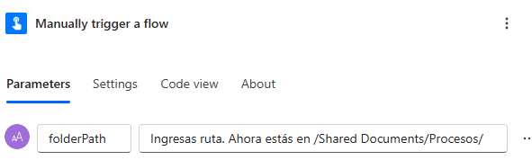
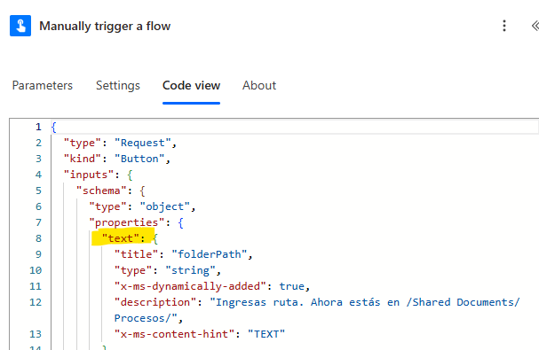
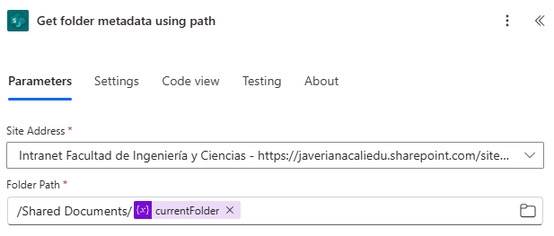
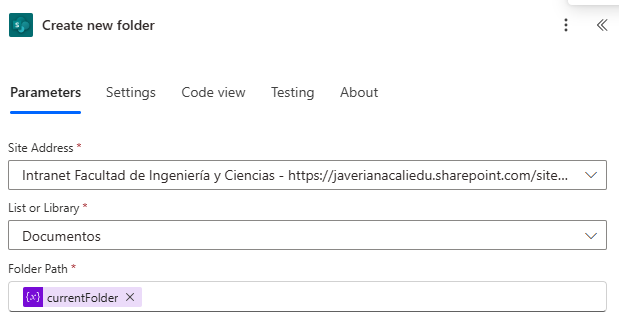
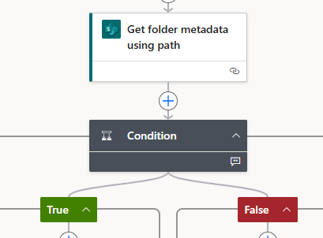
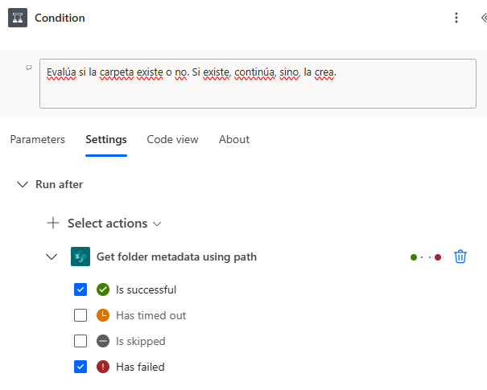

## Problemas y soluciones

**1. Acceso a parámetros de entrada del flujo:** Inicialmente hubo problemas con el acceso a la entrada de parámetros. Ya que los nombres para usar _Expressions_ con parámetros de entrada no es el que se le da a la variable sino el que está en el código. Es decir,

a pesar de que llamé a mi variable de entrada _folderPath_, el nombre a usar en alguna _expression_ es el que está en el código, es decir,

el nombre del primer parámetro de entrada es 'text'

**2. Acceso a las páginas de SharePoint:** Después hubo un problema con el acceso a las páginas del SharePoint. Pues cada bloque de direcciones requiere una o más detalles para el enlace. Es decir, por ejemplo en el bloque 'Get folder metadata using path', el cuál tiene 2 parámetros de entrada, uno es el 'Site Address' y el otro es el 'Folder Path'. \* En Site Address, debe ir la dirección del sitio de SharePoint, por ejemplo, https://javerianacaliedu.sharepoint.com/sites/FIC.

    * En Folder Path, se requiere aclarar en dónde se guardará la carpeta, por ejemplo, /Shared Documents/Folder1/Folder2.

Mientras que en el bloque 'Create new folder', el cuál tiene 3 parámetros de entrada, uno es el 'Site Address', otro es el 'List or Library' y el último es el 'Folder Path'.
_ En Site Address, debe ir la dirección del sitio de SharePoint, por ejemplo, https://javerianacaliedu.sharepoint.com/sites/FIC.
_ En List or Library, se debe especificar el nombre de la biblioteca de documentos, por ejemplo, 'Documentos compartidos'. \* En Folder Path, se debe especificar la ruta completa donde se creará la carpeta, por ejemplo, /Shared Documents/Folder1/Folder2.

**3. Problemas con el flujo al crear una carpeta:** Hubo problemas cuando la carpeta no existía y Get folder metadata using path devolvía cómo output de statusCode 404. Pues, incluso aunque se tuviese una condición que verificara si el statusCode era 404, se consideraba un error, el flujo se detenía y no se podía continuar.

Esto se solucionó configurando el bloque inmediatamente siguiente a Get folder metadata using path, el cuál es la condición, para que no se detuviera el flujo si Get folder metadata using path devolvía un error. Para esto, se debe ir a la configuración (Settings) del bloque (Condition) y en Run After, se debe seleccionar la opción 'has failed'. El cuál por default solo tiene la opción 'is successful'.

 De esta manera, si Get folder metadata using path arroja 'error 404', el flujo no se detiene y se puede continuar con la creación de la carpeta.

## Cómo funciona

## Aprendido
